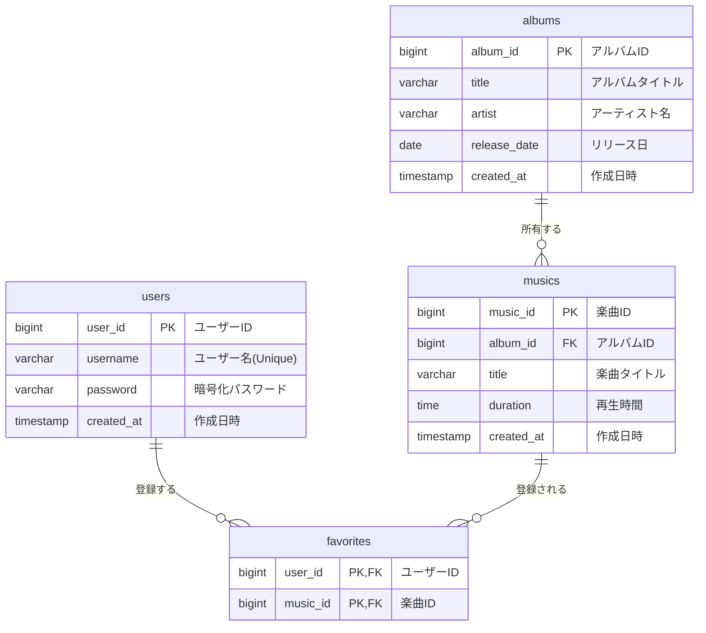

# 基本設計書：楽曲・アルバム管理システム

## 1. システム構成

* **Frontend**: Thymeleaf (HTML5 / CSS / JavaScript)
* **Backend**: Java 17+ / Spring Boot 3.x
* **Security**: Spring Security (認証・認可)
* **Database**: H2 Database / PostgreSQL 等 (MyBatis経由でアクセス)

---

## 2. データモデル設計（ER図）

楽曲管理システムのデータ構造を以下に定義します。ユーザー、アルバム、楽曲、およびそれらを紐付けるお気に入り情報の4つのテーブルで構成されます。

---

## 3. アプリケーション構造

本システムは「Controller-Service-Repository」の3層アーキテクチャを採用しています。

| レイヤー | 役割 | 主なクラス例 |
| --- | --- | --- |
| **Controller** | HTTPリクエストの受付、画面遷移、APIレスポンスの制御。 | `AlbumController`, `FavoriteRestController` |
| **Service** | ビジネスロジックの実行、トランザクション管理。 | `AlbumService`, `FavoriteService` |
| **Repository** | Mapper（MyBatis）を呼び出し、DBアクセスを抽象化。 | `AlbumRepository`, `UserRepository` |
| **Entity / Form** | DBテーブルに対応するオブジェクトおよび入力データ保持。 | `Album`, `MusicForm` |
| **ViewModel** | 画面表示用に最適化されたデータ（楽曲数やお気に入り状態など）。 | `AlbumViewModel`, `MusicViewModel` |

---

## 4. 主要API・エンドポイント設計

### 4.1 画面（UI）エンドポイント

| Method | Path | 説明 |
| --- | --- | --- |
| GET | `/login` | ログイン画面の表示 |
| GET | `/register` | 新規ユーザー登録画面の表示 |
| GET | `/albums` | アルバム一覧画面（検索機能含む） |
| GET | `/albums/{id}` | アルバム詳細画面（楽曲一覧・お気に入り操作） |
| POST | `/albums/new` | アルバムの新規登録実行 |

### 4.2 REST API（非同期操作用）

| Method | Path | 説明 |
| --- | --- | --- |
| POST | `/api/favorites` | 楽曲をお気に入りに追加 |
| DELETE | `/api/favorites` | 楽曲のお気に入りを解除 |

---

## 5. セキュリティ設計

* **認証方式**: フォーム認証 (Spring Security)
* **認可**:
* 公開パス: `/login`, `/register`, `/css/**`, `/h2-console/**`
* 保護パス: 上記以外すべて（要ログイン）

* **パスワード保護**: `BCryptPasswordEncoder` を使用し、DB保存前にソルト付きハッシュ化を実施。
* **CSRF対策**: Spring Securityのデフォルト機能により有効化。

---

## 6. 例外処理設計

システム固有の例外を定義し、不適切なアクセスやデータ欠損時に適切なメッセージを返却します。

* `AlbumNotFoundException`: 指定されたアルバムが存在しない場合にスロー。
* `MusicNotFoundException`: 指定された楽曲が存在しない場合にスロー。
* `DuplicateKeyException`: ユーザー登録時にユーザー名が重複している場合にキャッチ。

---
