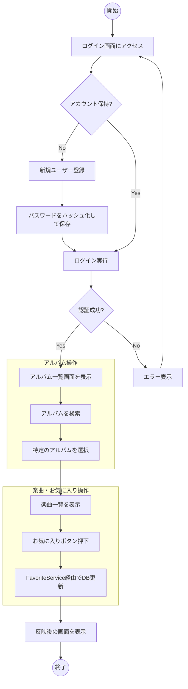

# 要件定義書：楽曲・アルバム管理システム

## 1. システム概要

本システムは、音楽アルバムおよびその収録曲（楽曲）をデジタル管理するためのWebアプリケーションです。ユーザーは自分専用のアカウントを持ち、アルバムの登録、楽曲の管理、およびお気に入り登録を行うことができます。

## 2. 機能要件

### 2.1 ユーザー管理

| 機能名 | 内容 |
| --- | --- |
| **ユーザー登録** | 新規ユーザーがユーザー名とパスワードを設定してアカウントを作成する。 |
| **ログイン/ログアウト** | 登録済みユーザーによるセッションの開始および終了。 |
| **認証・認可** | 未ログイン状態でのアルバム操作を制限し、セキュリティを確保する。 |

### 2.2 アルバム管理

| 機能名 | 内容 |
| --- | --- |
| **アルバム一覧表示** | 登録されている全アルバムを一覧表示する。各アルバムの楽曲数も表示される。 |
| **アルバム検索** | キーワードを入力し、アルバムタイトルから部分一致検索を行う。 |
| **アルバム詳細表示** | 特定のアルバムに紐づく楽曲リストを表示する。 |
| **CRUD操作** | アルバムの新規登録、編集、削除を行う。 |

### 2.3 楽曲（Music）管理

| 機能名 | 内容 |
| --- | --- |
| **楽曲登録** | 特定のアルバムに紐づく楽曲（タイトル、再生時間）を追加する。 |
| **楽曲編集・削除** | アルバム詳細画面から、各楽曲の情報の修正または削除を行う。 |

### 2.4 お気に入り機能

| 機能名 | 内容 |
| --- | --- |
| **お気に入り登録/解除** | 楽曲単位で「お気に入り」の状態を切り替える。 |
| **API対応** | 非同期通信（REST API）によるお気に入り状態の更新をサポート。 |

---

## 3. 非機能要件

* **セキュリティ**: パスワードはBCryptを用いてハッシュ化して保存。
* **データ保護**: データベース操作はMyBatisを使用し、サービス層でトランザクション管理を実施。
* **入力検証**: 楽曲登録時、紐づくアルバムが実在するか等の整合性チェックを行う。

---

## 4. アクティビティ図

以下は、ユーザーがログインしてから、アルバムを検索し、楽曲をお気に入りに登録するまでの主要なプロセスです。

## 5. 画面遷移（抜粋）

1. **ログイン / 登録ページ** (`/login`, `/register`)
2. **アルバム一覧ページ** (`/albums`)
3. **アルバム登録・編集ページ** (`/albums/new`, `/albums/{id}/edit`)
4. **アルバム詳細・楽曲管理ページ** (`/albums/{id}`)
5. **楽曲登録・編集ページ** (`/albums/{id}/musics/new`, `/musics/{id}/edit`)

---
